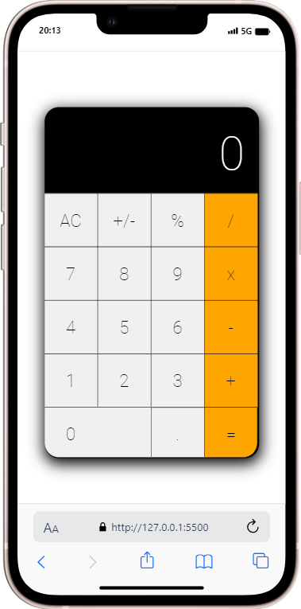
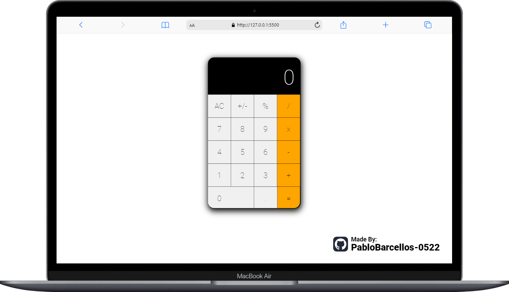

<h1 align="center"> Calculadora_Web </h1>

## 🚀 Tecnologias

Esse projeto foi desenvolvido com as seguintes tecnologias:

- HTML
- CSS
- JavaScript
- Git && Github

 
 

# Preview

    
    

#

<a href="https://pablobarcellos-0522.github.io/Calculator/" target="_blank">Clique aqui e veja o Projeto rodando :)</a>

 
 

## <b> Let's Connect..!</b>

 

